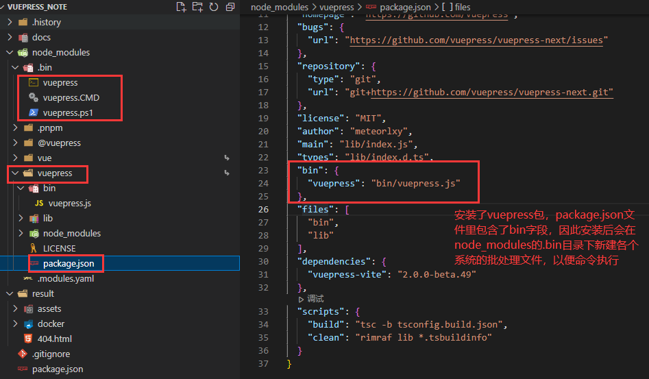
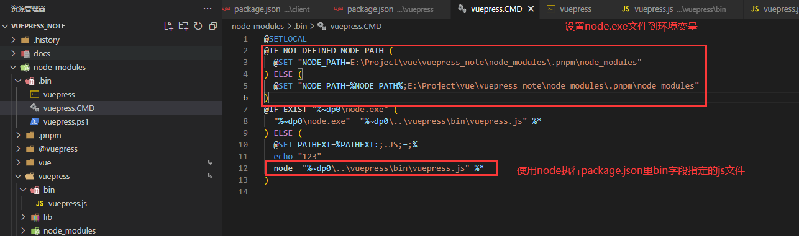
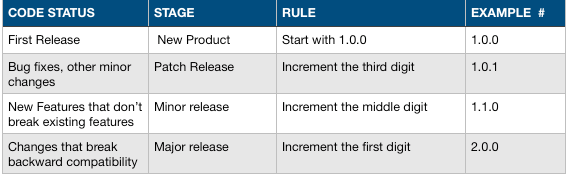

#### `中文文档`https://www.npmjs.cn/

#### `英文文档`https://docs.npmjs.com/

## npm是什么

- npm是js包管理工具
- npm提供网站页面给开发者搜索其他开发者提交到仓库的包（package）
- npm提供了一个全球的包仓库，提供给全球开发者进行上传已开发好的包
- 开发者在本地通过CLI（command line interfacec），在终端执行命令进行包的上传窗口，添加到项目，移除出项目等操作

## 安装并管理npm版本

    安装node环境时，会自动安装好npm包

    目前市面上还有其他的js包管理工具，比如yarn，pnpm，cnpm等，不过这些包管理工具都共用npm的仓库，下载包时都是从npm全球仓库下载，只是他们的本地包管理的方式有些区别

    其他的包管理工具可以先通过npm或非目标管理工具进行下载，然后对项目包进行管理

## npm环境配置

    1.主要配置下载包的缓存目录和全局安装包的目录

## package.json

    包的定义文件

    必须包含的字段：

    `name`：

    所有字母小写，一个单词，没有空格，名字中允许虚线或下划线

    `version`：

    使用 x.x.x的格式

    遵循 语义化 版本的约定

    `语义化 版本介绍：`https://semver.org/lang/zh-CN/

- 注意：

  如果package.json中没有description字段，npm则会使用README.MD文件的第一行或者README字符串代替

  添加上产依赖：npm install <package_name> --save

  添加开发依赖：npm install <package_name> --save-dev

## 包的安装

    有两种方式用来安装 npm 包：本地安装和全局安装。至于选择哪种方式来安装，取决于我们如何使用这个包。

- 如果你自己的模块依赖于某个包，并通过 Node.js 的 `require` 加载，那么你应该选择本地安装，这种方式也是 `npm install` 命令的默认行为

  ```js
  > npm install <package_name>

   上述命令执行之后将会在当前的目录下创建一个 node_modules 的目录（如果不存在的话），然后将下载的包保存到这个目录下。
   如果安装包的package.json文件里有bin字段，则会将bin字段对应对象的键作为名字在node_modules文件加下的.bin文件里建对应的批处理文件（Linux和windows系统都有）
  	在使用npm run 命令名 时，会先找自己的项目package.json文件的script字段里的命令，没有则去node_modules文件夹下的.bin目录里找对应的批处理文件
  ```

  举例如下：

  

  大概看下批处理文件，理解命令执行逻辑：

  

  ```js
  本质就是使用node.exe直接执行bin字段对象的key指定的js文件
  ```
- 如果你想将包作为一个命令行工具，（比如 grunt CLI），那么你应该选择[全局安装](https://www.npmjs.cn/getting-started/installing-npm-packages-globally)。

  ```js
  npm install -g <package_name>
  ```

## 包的更新和卸载

```js
npm update
npm uninstall
```

注意：不同的包管理工具对包的安装，更新和卸载命令可能有所不同，需要根据使用的具体包管理工具而定

## 如何发布到全球包仓库

    1.首先要拥有一个npm registry网站的用户名，可以到`https://www.npmjs.com/`进行注册

    2.如果已经有账号了，则使用npm login命令在终端登录（注意：npm的包地址如果被改成了淘宝的，则需要先改成官方的，才能进行登录）

    3.可以在终端使用npm whoami 查看登录状态

    4.如果有需要忽略上传的文件或文件夹，需要在`.gitignore` 或者 `.npmignore`文件中进行声明

    5.检查package.json文件，name字段对应的名字要唯一，最好先到网站搜索下是否有重名，名字要符合规范，不能违规

    6.package.json同级目录要准备一个readme.md文件，一定要是Markdown文件，且名字一定要是readme，因为官网会解析这个文件展示在网页上，给其他用户进行展示，这个文件用来描述你项目的相关信息

    7.一切准备好后，使用`npm publish` 命令进行发布

## 如何更新一个包到全球包仓库

    1.包里有文件更新后，想更新到仓库，则可以使用命令`npm version <update_type>`生成更新的版本

    2.update_type是语义化版本中版本一个类型：包括 patch（小版本）, minor（中版本）, or major（大版本），分别对应`x.x.x`的最后版本，中间版本，最高版本

    3.然后使用`npm publish `进行发布

    4.即使是readme.md文档的更新，也要走上面的1,2,3步

## 如何使用语义化版本

    最好最初的版本从1.0.0开始

    后续的版本变化可以参考下面的说明：



## 理解 package 和 module 的概念

    package ：

```js
1.一个文件夹包含一个package.json文件，那么这个文件夹就称为一个包
2.不管这个文件夹的来源，不管是gzip或网络下载，只要最终的形式是文件夹里包含一个package.json描述文件，则这个文件夹就是一个包
```

    module：

```js
1.一个文件夹包含一个package.json文件，且package文件里有main字段，则这个文件夹称为模块
2.一个文件夹包含了一个index.js，则这个文件夹称为一个模块
3.单独的一个js文件，也可以称为一个模块
```

注意：

    一个文件夹可以是包，但不一定是模块

    大多是情况下，一个包会被定义成一个模块

    nodejs是从node_modules文件夹下查找模块的，但这个文件夹下可以包含不是模块的包


## 常用命令介绍（不同的包管理工具查看具体文档）

- npm bin

  ```js
  npm bin [-g|--global]
  列出 npm 安装可执行文件的文件夹
  基本就是node_modules文件夹的.bin目录下的批处理文件夹，来自不同包的package.json中的bin字段
  ```

## package.json常用配置文件字段详解

    **详细参考**：https://www.npmjs.cn/files/package.json/

- `name` 包名
- `version` 版本
- `description` 描述，方便其他人搜索
- `keywords` 关键字 ，方便其他人搜索
- `homepage` 项目相关的网站主页地址
- `bugs` bug提交说明，用户说明如果有BUG，其他用户如何提交这个BUG，访问BUG地址或邮箱

  ```
  { 
  "url" : "https://github.com/owner/project/issues",
  "email" : "project@hostname.com"
  }
  可以只写一个或都写，如果只写一个，则可以直接写成字符串，不用写成对象的形式
  ```
- `license` 开源协议说明
- `author` 作者信息，包括name,email,url
- `contributors` 贡献者 ，数组，包括多个name,emal,url
- `files` （待补充）
- `main` 模块的入口文件，比如，你的包名字是foo，则别人安装后，使用require("foo")，则会执行这个main字段对应的文件，导出对应的模块对象，这个文件应该是你package.json所在目录或其子目录里的文件
- `browser` 如果你的模块文件是在浏览器使用，则入口文件应该用此字段声明，而不要用main字段，因为main字段声明的文件遵循comonjs规范，使用require导入，而浏览器不识别这个规范
- `bin` 可执行文件声明。经常性的，我们的包里需要有些命令装进path路径，以便在终端使用npm run 命令名 来让node执行我们指定的js文件

  因此可以把需要执行的文件声明到bin字段中，当安装了此包后，会在全局的bin目录或项目的node_module文件夹下的.bin目录里创建符号链接（即各个系统的批处理文件）

  如果我们的包里只指定一个可执行文件，则bin字段可以直接映射这个可执行文件路径：

  ```js
  { 
  "name": "my-program",
  "version": "1.2.5",
  "bin": "./path/to/program"
  }
  ```
  等价于下面的形式：

  ```js
  { 
  "name": "my-program",
  "version": "1.2.5",
  "bin" : { "my-program" : "./path/to/program" }
  }
  ```
  注意：

      可执行文件的开头，一定要是**#!/usr/bin/env node**

      比如：

  ```js
  #!/usr/bin/env node

  require('vuepress-vite/bin/vuepress')
  ```
- `man` 帮助文档说明
- `directories` 指明包的目录结构
- `repository` 说明代码位置

  ```js
  "repository": {
    "type" : "git",
    "url" : "https://github.com/npm/cli.git"
  }

  "repository": {
    "type" : "svn",
    "url" : "https://v8.googlecode.com/svn/trunk/"
  }
  ```
- `scripts` 可执行指令的字典
- `config` 自定义属性，在可执行脚本中可以读取这些配置属性，用户安装这个包后，可以通过命令覆盖配置的属性

  ```js
  我们包中的属性：
  { "name" : "foo"
  , "config" : { "port" : "8080" } }
  用户安装包后，如想覆盖配置，则可以使用
  npm config set foo:port 8001
  ```
  如果我们的脚本中想使用自己包package.json中的字段值，可以使用 **`npm_package_` 键名**的形式

  ```js
  比如在脚本文件中，打印包的名字和版本：
  console.log(process.env.npm_package_name)
  console.log(process.env.npm_package_version)

  使用上面的config自定义属性，则前缀名是 npm_config_
  比如：
  console.log(process.env.npm_config_port)
  ```
- `dependencies` 开发依赖，开发依赖不要放测试依赖或转发器，否则会被打进生成的js中
- `devDependencies` 开发依赖
